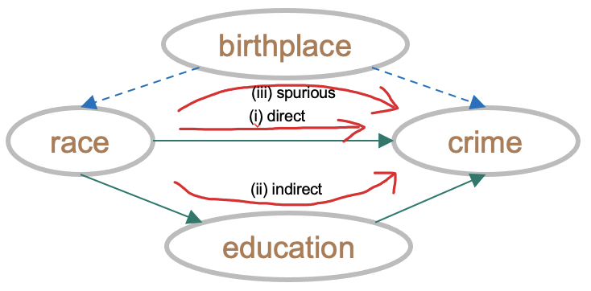

# Fairness & Bias: High-level Overview and Ideation

---

## Preset

Assume we have the COMPAS dataset, we have a juror (*aka. model / causal model*) who follows an internal logic (*aka. algorithm / causal mechanism*). We also assume the juror has a good understanding of the system and makes good predictions (*model with high performance*).

Assume we also have an existing dataset, based on the actions of this juror (*aka. COMPAS dataset*) in predicting recidivism on a certain population. Meaning this dataset has *predicted recidivism scores* and *actual recidivism scores*.

## What is the question we are looking for?

In broad terms, we want to know, **whether there was racial bias in predicting recidivism.**

The **causal question**: Are we marking individuals released on parole with high risk of re-offending within 2 years (Y) due to their race (X)? If yes, how di we mitigate that?

---

## Two Primary Research Questions

1. **Bias** (*Bias Quantification*) Is there a bias in the combination of model & dataset? How do we measure/ quantify bias?
2. **Fairness**: (*Bias Mitigation*) What are the changes in the policy/treatment needed, to mitigate the estimated bias?

## Optimization Measure

Let's move forward with ***Total Variation (TV)***, as marked in "Causal Fairness Analysis" paper

---

## Questions to Quantify Bias - Pathway towards Bias

1. **Observational Bias 1**: check difference between predicted recidivism scores and actual recidivism scores in each race group? --- predicted rec scores, actual rec scores, race
2. **Biased Prediction 1**: check if african-americans are given more recidivism scores than caucasians? --- data (with only predicted), assumes no ground-truth discrimination between groups
3. **Biased Prediction 2**: check if african-americans are given more recidivism scores than caucasians, and compare with actual recidivism scores? --- data, no assumptions
4. **Conditional Bias 1 & 2**: check if african-americans are given more recidivism scores than caucasians, conditional on all other variables? --- data, assumes no ground-truth discrimination between groups
5. **Causal Bias 1**: given we known the **SCM** (along with known data & model), check if african-americans are given more recidivism scores than caucasians? --- data, predicted outcome, causal model
6. **Causal Bias 2**: given we known the **SFM** (along with known data & model), check if african-americans are given more recidivism scores than caucasians? --- data, predicted outcome, causal model
7. **Distribution of TV**: 

---

## Questions to Mitigate Bias - Pathway towards Fairness

To my understanding, there is no **non-causal** version of this question. Because, if we can't identify which treatment variables to alter, there is no way of mitigating bias.

1. **Causal Fairness 1**: What factors can be changed to minimize total variation (TV) between predicted recidivism scores of african-americans and caucassians? Cross-check with predicted recidivism scores since otherwise it doesn't make sense to predict fair.
2. **Causal Fairness 2**: If the variable race is not avialable in the dataset, would the model still have similar predicted recidivism scores?
3. **Causal Fairness 3**: How to remove direct and spurious effect but keep only indirect effect?
4. **Paper**: Explore all other defintions from paper

---

## Data Description

### Features:

1. Protected attribute, X = race, (*common protected attributes: race, religion, national origin, gender, marital status, age, and socioeconomic status; depends on problem domain and their relevant laws and policies*)
2. Confounders, Z = gender, age
3. Other variables, Z1 = age of offender at first offense (age_first_offence), and all other vars
4. Mediators, W =  juvenile offense counts (juv_fel_count), prior offencse counts (priors_count), degree of charge ()
5. Potential Biased Outcome, Y = recidivism score (two_year_recid)
6. x0 = "Male", x1 = "Female" (*taking help from 'fairness' R library by Drago Plecko*)
